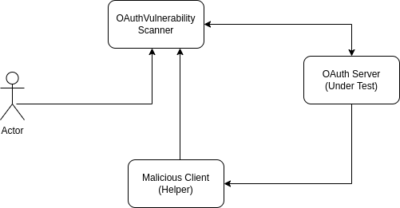
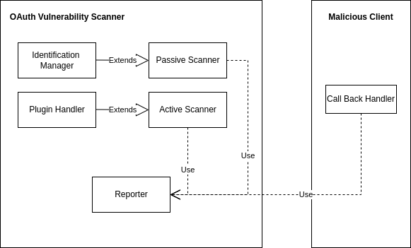
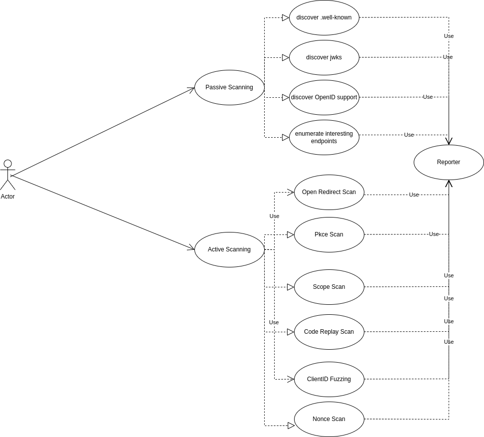

# OAuthVulnerability Scanner

This security tool is an auditing framework for Authorization Servers which scans to detect security misconfigurations. It can be a usefull tool to detect security misconfigurations in Authorization Servers that use OAuth. 

This project was created as part of my research work conducting my master thesis in university of Aegean.

# Available Scans

> Passive scan:
It enumerates an authorization server by its metadata as they are described by the relevant spec [RFC8414](https://datatracker.ietf.org/doc/html/rfc8414)

> Active scan:
Based on the information that isT gathered from passive scan and by providing some further information about user and client this scanner can run the following scans:

- PKCE Downgrade 
- Authorization Code Replay
- Nonce Replay / Nonce Evaluation
- Scope Evaluation
- Open Redirect Scans
- Fuzzing Client (it uses /resources/client_ids file to fuzz the clients )

# The project's structure

## High Level Architecture Diagram

## Entity Diagram

## Use Cases

# How to install

Create a Virtual environment:

    python -m venv /<projects_dir>/OAuthVulnerabilityScanner/OAuthScanner/venv

    source venv/bin/activate

Install dependencies:

    pip3 install -r requirements

# How to use

The usage of the tool is through a user friendly CLI:

Run `app.py` into the scanner's directory  :

    python3 app.py -h

    -- Examples of usage
      `python3 app.py -t p a --mode=ALL --proxy=http://localhost:7777 --log=True`
      `python3 app.py -t a --mode=N`

## Flags and capabilities ##

- --t(ype) : a(ctive) or p(assive) or both of them 
- --navigation: selenium (only "selenium" as option)
- --m(ode) : P[KCE], N[once], S[cope],R[e]P[layScan],R[e]D[irectScan],F[uzzing]C[lient], ALL 
- --avoid_replays: it enforces the refreshment of authorization code on every scan that requires a new auth code (boolean)
- --pkce : enforces the usage of pkce challenge-response in the selected scan (boolean)
- --proxy: provides a proxy server to intercept the requests
- --log: creates graceful debug logs 
 
# Configuring the settings

Configure the `settings.json` accordingly, in order to setup a target to scan:

    {
        "client_id":"my_client", 
        "client_secret":"client_secret",
        "base_url":"auth_server's base url",
        "username": "admin",
        "password": "admin",
        "oauth_vendor": "vendor's name"
    }

In order to run passive scan the only mandatory field is `base_url` in order for authorization server to be specified before starting enumerating.

Active scan requires more settings in settings JSON.

`Client id/Client secret` are mandatory in some types of scan such as `Authorization Code Replay`

`Username/password` could be omitted if we use --navigation=selenium as navigation method which eventually will prompt the user to provide them during the scanning phase, but they are required if the selected mode of navigation is none and it means that scanner will try to use http client to bypass login screens and so on. So in this case the credentials are required.

`enforce_base_url` is another optional field that could be useful if the user wants to enforce the base url in all of the results of passive scanning. So by using this flag, the user enforces the scanner to change all the base urls 
from the results of passive scanner to those that have been provided in `base_url` field.

`oauth_vendor` is mandatory only if we don't use navigation mode selenium in order to determine the specific authentication flow that the system under test uses. 
    
        e.g 'oauth_vendor': 'keycloak'

In order to use `selenium` it is recomended to configure a user profile. Many authentication systems could prevent the access from a bot and the profile's configuration is recomended to bypass unwanted blockings in this case. This field is optional but recommended. To configure it use `firefox_profile`:

        'firefox_profile': '/home/<user>/.mozilla/firefox/123123.main'

Use `termination_element` (optional) as string of XPATH selector to define the identical element that should be used to terminate the navigation when --navigation=selenium

## Test and further development ##

During the development of this project, the following repository which keeps a testbed of the relevant OAuth Servers was created:
    
    https://github.com/vagelkara/OAuthTestServers

### Notes: ###
- Known issue for casdoor in navigation=selenium returns False Positive result. Use scan without navigation to get real results

- Open Redirect Scan requires an active cookie to be performed. This is only feasible to be captured in non navigation mode since selenium doesn't have a way to intercept or to send the involved cookie back to the scanner.

- Fuzzing Client returns false positives in cassdor case because it returns always the same JS response and cannot detect an actual change in the response

